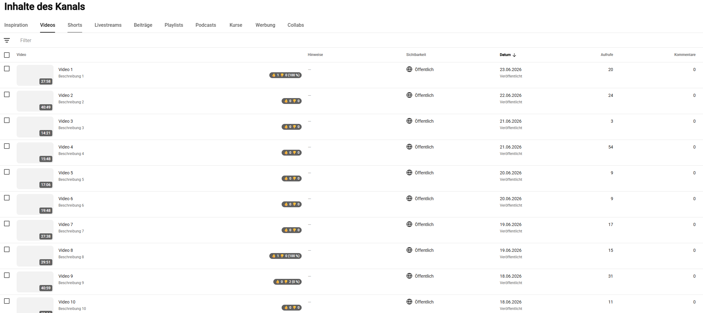
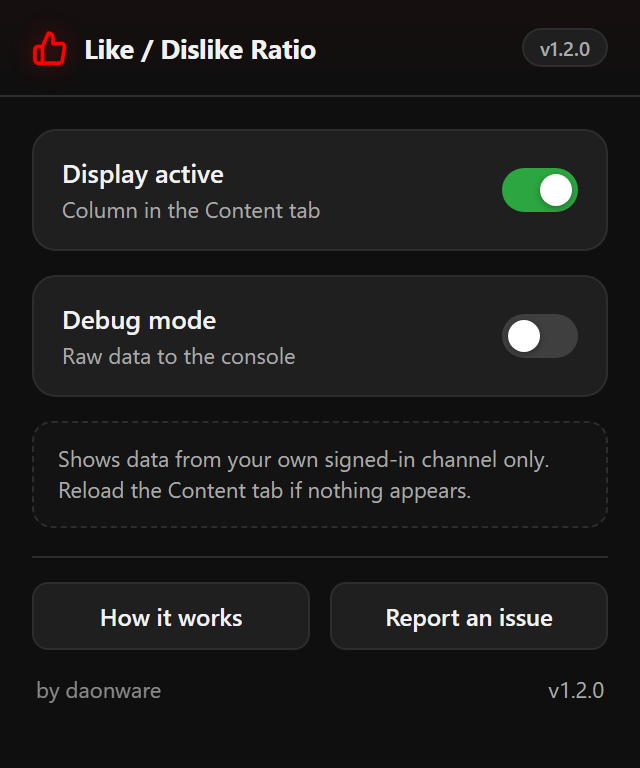
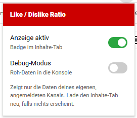

# YT Studio Like/Dislike Ratio

[Deutsch](README.md) · **English**

A small browser extension that brings back the **like/dislike ratio in the
YouTube Studio content tab** — in its own **"Likes (vs. Dislikes)" column** on
the far right, with 👍/👎 numbers, a ratio bar and percentage (exact numbers also
in the tooltip). A second **"Subscribers (total)" column** also shows how many
subscribers each video gained net since it was published.



<p align="center">
  
  &nbsp;&nbsp;
  
</p>

## How it works (and why it's harmless)

- The extension only runs on `studio.youtube.com`.
- It **reads along** with what the Studio page loads anyway (internal
  `youtubei` endpoints) and re-displays the ratio.
- It makes **no requests of its own**, does not forge auth headers, and sends
  **nothing to third parties**. Everything happens locally in the browser.
- Everyone only ever sees the data of **their own signed-in channel** — because
  the extension simply uses the existing session.

## Build

The extension is **Manifest V3** and runs in both Chrome and Firefox. Because
Firefox additionally requires `browser_specific_settings` (which Chrome rejects),
a small build script produces a per-browser package under `dist/` (only Node.js
needed, no dependencies):

```
npm run build           # builds dist/chrome and dist/firefox
npm run build:chrome    # Chrome only
npm run build:firefox   # Firefox only
```

## Install locally (for testing)

**Chrome / Edge / Brave**
1. Run `npm run build:chrome`
2. Open `chrome://extensions`
3. Enable "Developer mode" in the top right
4. "Load unpacked" → select the `dist/chrome` folder
5. Open `studio.youtube.com` → Content, reload the page if needed

**Firefox** (version 128 or newer)
1. Run `npm run build:firefox`
2. `about:debugging#/runtime/this-firefox`
3. "Load Temporary Add-on" → select `dist/firefox/manifest.json`
   (For permanent use the add-on must be signed on AMO.)

## When nothing appears (debug)

YouTube changes its internal endpoints without warning. If the column stays
empty:

1. Click the extension icon → turn on **Debug mode**
2. Reload the Content tab, open the developer console (F12)
3. Filter for `[YTSR]`. The detected fields and raw payloads are printed there
   (incl. `[YTSR][recon]` and `[YTSR][dislike-DATA]`).

Send me the console output and I'll fine-tune the field mapping exactly.

## Current state (v1.1.0)

- Adds its own **"Likes (vs. Dislikes)" column** on the far right of the content
  tab, after "Comments" — title in the header, one cell per video with 👍/👎
  numbers, a **two-color ratio bar** (green = likes, red = dislikes) and
  percentage.
- Additional **"Subscribers (total)" column**: net subscribers gained per video
  since publication — green for gains, red for losses. Values are fetched
  sparingly and only for visible videos via Studio's analytics endpoint
  (`yta_web/get_cards`, metric `SUBSCRIBERS_NET_CHANGE`).
- **Readable numbers**: large values compact (`49.3K`, `2.1M`), smaller ones
  exact with thousands separators (`1,204`); bold, evenly-spaced digits.
- Runs in **Chrome and Firefox** (per-browser packages via `npm run build`).
- **Likes** come from `videos[].publicMetrics.likeCount`; **dislikes** are
  actively fetched via Studio's own endpoint (`get_creator_videos`,
  `metrics.dislikeCount`) — all within your running session, no extra permissions.
- Until the dislikes arrive, the cell shows the like value in a subtle loading
  state; the real ratio appears afterwards.

## Files

```
manifest.json        – configuration (Manifest V3, Chrome base)
scripts/build.mjs    – produces per-browser packages in dist/
src/inject.js        – reads network responses & fetches dislikes/subscribers
src/content.js       – builds both columns into the header and video rows
src/styles.css       – appearance of the columns (bar, colors, spacing)
popup/               – small settings popup (on/off, debug)
icons/               – icons
```
